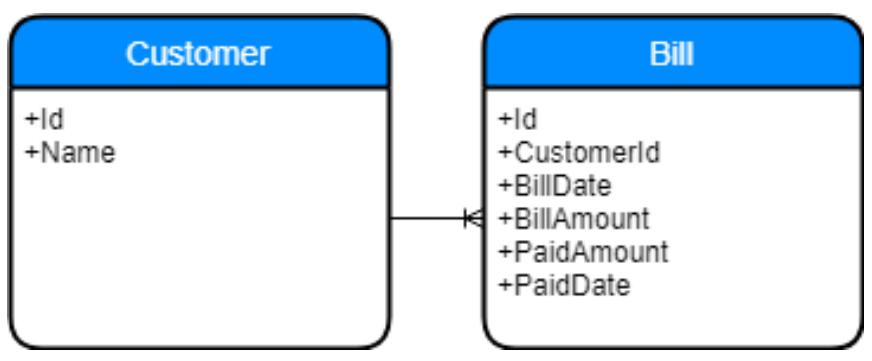

## Background
This is an interview solution for a test of a company @ Oct 2020. The question is originally in a PDF, converted it into markdown format for github viewing and portability.

## Question
We have a system that issues usage bills to our customers every month.

When customers pay their outstanding usage bill, they will usually update us via email with 
transfer receipt. The finance department will then mark the bill as paid.

**_However_**, customers will sometimes fail to notify us. When our finance department checks 
the account statement, they will notice payments from unknown parties. Finance will then 
manually check against outstanding bills and try to determine possible payors.

As we issue thousands of bills per month, this manual process is naturally untenable. 
Finance has requested for a function that can return list of possible customers when an 
amount is keyed-in.



Notes:
- When a bill is created, the `PaidAmount` is 0 and `PaidDate` is undefined (null).
- When a bill is fully paid for, the `PaidDate` is set, and the `PaidAmount` shall be the same as `BillAmount`.
- It is possible for a Bill to be partially paid. In this scenario, the `PaidAmount` shall indicate the partially paid amount, but the `PaidDate` shall remain undefined.
- Therefore, outstanding amount = `BillAmount` - `PaidAmount`
- A customer may have zero or multiple outstanding bill at any time.


Please write a function, in your programming language of choice, to solve the following.


```c#
IEnumerab1e<int> GetPossibleCustomerIdsForOutstandingAmount(
    List<Bi11> outstandingBi11s,
    decimal amountToMatch)
{
    // ...
}
```

Your function will be given input of a list of outstanding bills, and the outstanding amount to match. Fully paid for bills will not be included in `outstandingBills`. Your function must return zero, one or multiple customer IDs that may have one or more bills with sum of outstanding amount matching the value specified by `amountToMatch`.

## Solution
- All the requirements are unit tested in `BillUsageSystem_test.py`
- The solution is in `GetPossibleCustomerIdsForOutstandingAmount.py`. 
    - This is to fulfilled the question requirement of creating a function to be used by other team as an API.
